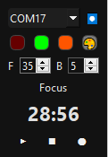

# Squishy Light Controller 🐸💡

A PySide6 desktop widget for controlling an Arduino-driven LED strip (living inside a squishy toy) via serial — letting you override the physical pressure sensor with digital color and lighting-effect control, plus a built-in Pomodoro focus timer.



## Features

### Basic controls
- 🔌 **Auto port detection** — populates the COM port dropdown automatically
- 🔴🟢⚫ **Quick color swatches** — three preset buttons (defaults: red, green, off) apply instantly on click
- 🔄 **Sensor mode** — hands control back to the physical pressure sensor (via the Effects menu)

### Custom colors
- 🎨 **Color wheel picker** — double-click the palette button for a live color wheel
- 🌈 **Real-time preview** — LEDs update live as you drag around the wheel
- 🎯 **Full RGB range** — 0–255 per channel
- 🖱️ **Single-click recall** — a single click re-applies the last custom color you picked

### Pomodoro timer
- 🍅 **Focus/break cycle** — configurable focus and break durations (1–60 minutes each, via the `F`/`B` spinners)
- ⏱️ **Countdown display** — live `MM:SS` readout with a status label (Ready / Focus / Break / Stopped)
- 🔔 **Automatic transitions** — LEDs switch color automatically between focus and break
- ✨ **Break flash toggle** — optionally pulse the LEDs on/off during breaks instead of holding solid color
- 💾 **Settings persistence** — window position/size, saved colors, focus/break minutes, and the flash toggle are all remembered between launches

### Lighting effects
Selected from the effects dialog (⬤ button):
- 💨 **Breathing** — gentle brightness pulsing
- 💓 **Heartbeat** — double-beat pulse in the current color
- 🌈 **Gradient** — smooth rotating color bands around the ring
- ☄️ **Comet (+ / −)** — bright point with a fading tail, travelling clockwise or counter-clockwise
- 🕯️ **Candle** — warm flickering
- 🎵 **Beat pulse** — sharp pulse, good for syncing to music
- 📈 **Intensity** — sets brightness directly from the current color
- 🔄 **Sensor mode** — returns control to the physical pressure sensor

> **Note:** the Arduino firmware also includes fully-implemented **Sunrise, Sunset, Lava Lamp, Ocean, Forest, Fire, Aurora,** and **Progress Halo** effects, but their serial commands are currently commented out in `squishy_lights.ino`'s command handler, so they aren't reachable from the app yet. Uncomment the relevant `else if` blocks to enable them, and add them to the `EffectsDialog` list in the Python app to expose them in the UI.

### Technical features
- 🖥️ **Compact always-on-top widget** — frameless, draggable, dark themed; hover the top edge to reveal a close button, double-click to snap back to its saved position
- 📡 **Event-driven serial I/O** — uses PySide6's `QtSerialPort` (no separate `pyserial` dependency)
- 📦 **Standalone build** — packaged into a Windows `.exe` via PyInstaller

## Hardware Requirements

- Arduino-compatible board (e.g. Arduino Beetle or similar)
- WS2812B LED strip — 12 LEDs, connected to **data pin 11**
- Optional analog pressure/light sensor on `A0` for sensor mode
- FastLED library installed on the Arduino
- USB cable for serial communication (9600 baud)

## Software Requirements

- Python 3.x
- [PySide6](https://pypi.org/project/PySide6/) (includes `QtSerialPort`)

## Installation

1. **Clone or download the project files**

2. **Install Python dependencies:**
   ```bash
   pip install PySide6
   ```

3. **Upload the Arduino firmware:**
   - Open `squishy_lights.ino` in the Arduino IDE
   - Install the **FastLED** library
   - Select your board/port and upload

4. **Run the application:**
   ```bash
   python squishy_light_controller_REV2.py
   ```

5. **(Optional) Build a standalone executable** — see [Building a Standalone Executable](#building-a-standalone-executable) below.

## Building a Standalone Executable

Package the app into a single Windows `.exe` — no Python installation required to run it.

### Prerequisites
- Python 3.7+ with `PySide6` and `pyinstaller` installed (`pip install PySide6 pyinstaller`)
- All project files in the same folder:
  - `squishy_light_controller_REV2.py`
  - `squishy_light_controller.spec`
  - `toad.ico` (or a `toad.png` you convert — see below)

### Build steps

1. **Install requirements:**
   ```bash
   pip install PySide6 pyinstaller
   ```

2. **Convert your icon (if you only have a `.png`):**
   ```bash
   pip install Pillow
   python -c "from PIL import Image; img = Image.open('toad.png'); img.save('toad.ico', format='ICO', sizes=[(16,16), (32,32), (48,48), (64,64), (128,128), (256,256)])"
   ```
   The build will still succeed without this, but the `.exe` will fall back to a default icon.

3. **Build the executable:**
   ```bash
   pyinstaller --clean squishy_light_controller.spec
   ```

### Output
- **`dist/SquishyLightController.exe`** — your standalone executable
- **`build/`** — temporary build files (safe to delete)
- **`toad.ico`** — the converted icon, if you generated one

### Distribution
The resulting `.exe` can be:
- Copied to any Windows computer and run directly — no Python needed
- Shared with others, or run from a USB drive
- Added to the Windows startup folder for auto-launch

### Build troubleshooting

**Build fails?**
- Confirm Python and pip are on your `PATH`
- Try running the command from an elevated/administrator prompt
- Check that `squishy_light_controller_REV2.py` and `squishy_light_controller.spec` are both present

**Icon doesn't show?**
- The build will still complete without `toad.ico` — it just falls back to the default icon
- Make sure `toad.png` is a valid image before converting
- Sometimes the icon will not show unless pinned to taskbar

**.exe won't run?**
- Launch it from a command prompt to see the actual error output
- Some antivirus software (including Windows Defender) may flag PyInstaller executables as a false positive — this is a known PyInstaller quirk, not a sign the file is unsafe

### File size
Expect roughly **80–120 MB**. That's normal for a PyInstaller build bundling the Python runtime and the full PySide6 GUI framework, and it's what lets the `.exe` run on any Windows machine with zero dependencies.

## Usage

### First-time setup
1. Connect the Arduino via USB
2. Launch the application
3. Select the correct COM port from the dropdown
4. Click the connect button (⏺) — it switches to ⏹ once connected

### Controlling the lights
- Click a preset swatch to apply that color instantly
- Double-click the palette button to open the color wheel and pick a custom color live
- Single-click the palette button to re-apply the last custom color

### Running a Pomodoro session
1. Set your focus (`F`) and break (`B`) durations with the spinners (1–60 minutes)
2. Press ▶ to start — LEDs switch to your focus color and the countdown begins
3. LEDs automatically switch to the break color when focus time ends, and flash if the break-flash option is enabled
4. Press ■ to stop at any time

### Using effects
1. Click the effects button (⬤)
2. Choose an effect from the list, and toggle "Enable break flash" if desired
3. The effect starts immediately using your currently selected color

## Communication Protocol

The Arduino accepts these serial commands:

**Basic colors:**
- `RED` / `GREEN` / `OFF` — set a preset static color
- `RGB:r,g,b` — set a custom static color (e.g. `RGB:255,128,64`)

**Effects (currently enabled):**
- `EFFECT:BREATHING`, `EFFECT:HEARTBEAT`, `EFFECT:GRADIENT`, `EFFECT:COMET+`, `EFFECT:COMET-`, `EFFECT:CANDLE`, `EFFECT:BEAT`

**Effects (implemented, not yet wired up):**
- `EFFECT:SUNRISE`, `EFFECT:SUNSET`, `EFFECT:LAVA`, `EFFECT:OCEAN`, `EFFECT:FOREST`, `EFFECT:FIRE`, `EFFECT:AURORA`, `EFFECT:PROGRESS`

**Effect parameters:**
- `SPEED:n` — effect speed (0–255)
- `INTENSITY:n` — brightness/intensity (0–255)
- `EFFECT_COLOR:r,g,b` — set the color used by the current effect
- `PROGRESS:n` — set progress value (0–100), for use with the Progress Halo effect

**Control:**
- `SENSOR_MODE` — return to physical pressure sensor control
- `EFFECT_NONE` — stop the current effect
- `STATUS` — query current mode/state

All commands return an acknowledgment (e.g. `OK:RED`, `OK:EFFECT:BREATHING`) or `ERROR:...` if malformed/unrecognized.

## Troubleshooting

### Connection issues
- Make sure the Arduino is connected via USB and shows up as a COM port
- Try reopening the app to refresh the port list
- Check that no other application (e.g. the Arduino Serial Monitor) is holding the port open
- Confirm the Arduino is running the correct firmware

### Communication problems
- The app waits ~2 seconds after connecting for the Arduino to reset — this is expected
- Try disconnecting and reconnecting from the port dropdown/connect button
- An `ERROR:UNKNOWN_COMMAND` or `ERROR:INVALID_RGB_FORMAT` response means the command sent didn't match the expected format

### LED issues
- Verify the LED strip is connected to **data pin 11**
- Check the LED strip's power supply
- Confirm the FastLED library is installed and the strip type (`WS2812B`) matches your hardware

## Technical Details

### Arduino firmware
- Uses the FastLED library to drive a WS2812B strip
- Serial communication at 9600 baud
- Three modes: `SENSOR_MODE` (reactive to the physical sensor), `STATIC_COLOR`, and `EFFECT_MODE`
- 12 LEDs on data pin 11
- A wider range of effects (breathing, sunrise, sunset, lava, heartbeat, rotating gradient, comet, candle, ocean/forest/fire/aurora mood palettes, progress halo, beat pulse) is implemented in code; see the Communication Protocol section for which are currently reachable via serial commands

### Python application
- Built with PySide6 as a frameless, always-on-top mini widget (not a full window)
- Serial I/O via PySide6's `QtSerialPort`
- Settings (window position/size, colors, focus/break durations, break-flash toggle) persisted with `QSettings`

## File Structure

```
squishy_lights/
├── squishy_lights.ino                    # Arduino firmware
├── squishy_light_controller_REV2.py      # Current PySide6 application (built by the .spec)
├── squishy_light_controller.py           # Earlier revision, kept for reference
├── squishy_light_controller.spec         # PyInstaller build spec
├── toad.png                              # Source icon (you supply this)
├── toad.ico                              # Converted icon, generated during build
├── dist/                                 # Build output — SquishyLightController.exe lands here
├── build/                                # Temporary PyInstaller build files
├── images/
│   └── app_screenshot.png                # App screenshot for this README
└── README.md                             # This file
```

## License

This project is provided as-is for educational and personal use.